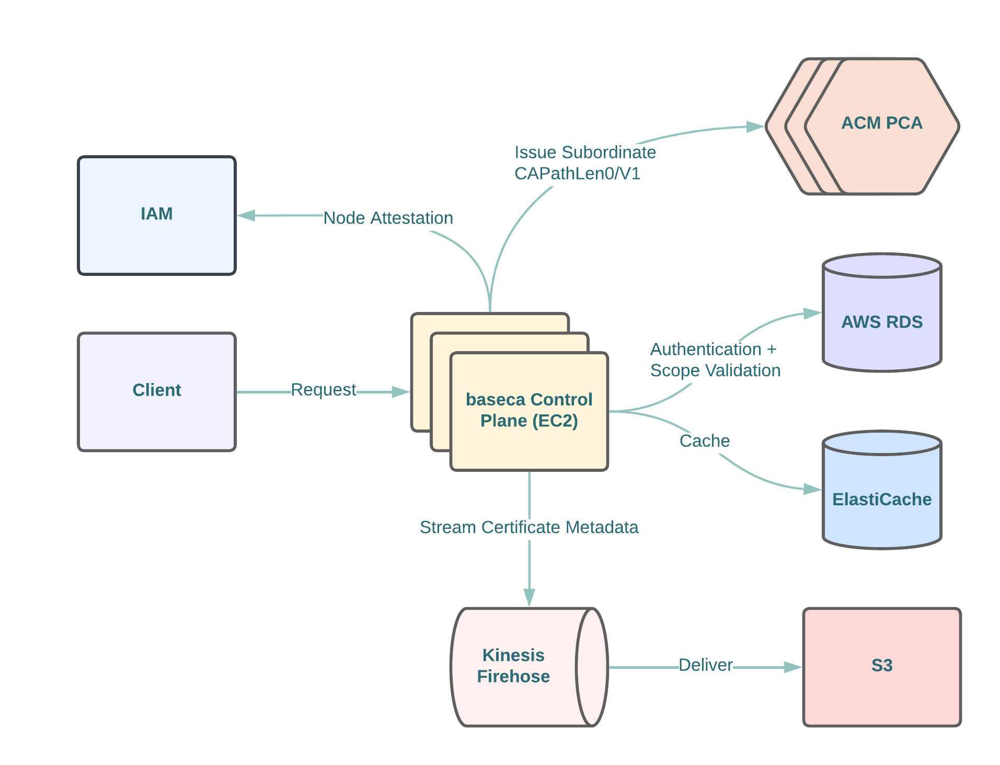

  

## Overview

`baseca` is a `gRPC` service that serves as a Public Key Infrastructure (PKI) control plane that issues short-lived x.509 certificates at runtime using attestation.

### Use Cases

`baseca` integrates with AWS Private CA and becomes as a management layer and a Certificate Authority; instead of issuing leaf certificates directly from Private CA, `baseca` issues and manages Subordinate Certificate Authorities from upstream used to sign requests depending on the [`scope`](docs/SCOPE.md) of a service account.

- Client Authentication
- Server Authentication
- Code Signing

### Running `baseca`

- [`Architecture`](docs/ARCHITECTURE.md)
- [`Getting Started`](docs/GETTING_STARTED.md)
- [`Production Deployment`](docs/PRODUCTION_DEPLOYMENT.md)
- [`baseca gRPC Methods`](docs/ENDPOINTS.md)

### Benefits

- Short-Lived Certificates with Ephemeral Private Key Material
- No Limits on Number of Issued Certificates
- Protects Issuance of Certificates on Scope
- Supports Node Attestation
- Supports Issuance from On-Prem and Multi-Cloud
