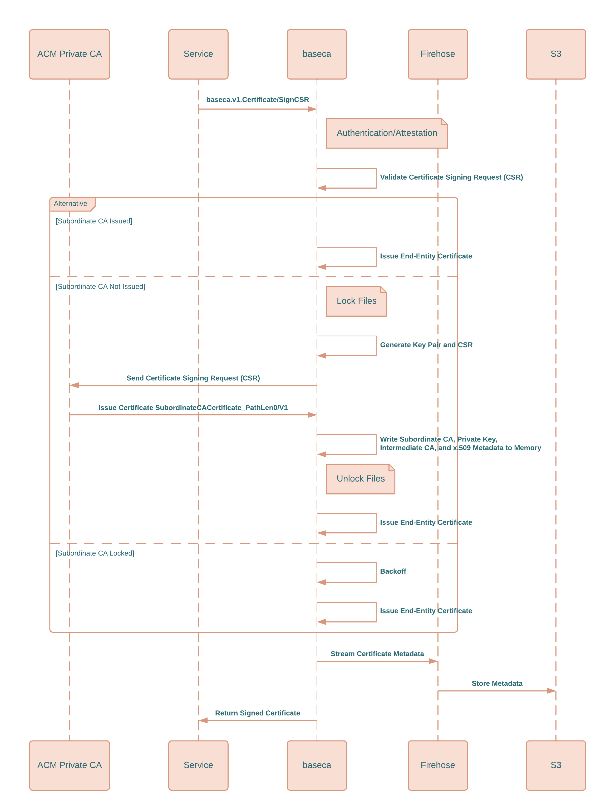

# `baseca` Architecture

At the core, `baseca` is a control plane used to issue certificates for service accounts within a granted scope. Instead of issuing [`end-entity certificates`](https://docs.aws.amazon.com/privateca/latest/userguide/UsingTemplates.html#EndEntityServerAuthCertificate-V1) directly from AWS, baseca issues [`subordinate certificate authorities`](https://docs.aws.amazon.com/privateca/latest/userguide/UsingTemplates.html#SubordinateCACertificate_PathLen0-V1) from upstream Root Certificate or Intermediate Certificate Authorities from Private CA. When certificate signing requests (CSR) are sent to `baseca`, the service authenticates and validates based off the scope of the service account and signs the CSR in memory within the control plane.

  

Prior to client authentication, a service account must be provisioned for baseca. For detailed information on service accounts and their associated scopes, please refer to the [`SCOPE.md`](SCOPE.md) document.

Upon receiving an RPC request, baseca validates the client's credentials against the stored service account within RDS. Successful authentication triggers a Node Attestation process which verifies that the request originates from the designated instance. If the request signature fails to match the scope outlined in the service account, authentication will be denied.

Post-authentication, the Certificate Signing Request (CSR) attached to the request is verified, and an X.509 certificate is issued corresponding to the scopes of the service account. During the certificate signing process, baseca checks the `/tmp/baseca/ssl` directory for an existing Subordinate Certificate Authority (CA). If none exists, baseca communicates with AWS Private CA using the `SubordinateCACertificate_PathLen0/V1` template to generate a Subordinate CA. This Subordinate CA is then stored in memory and utilized for signing incoming requests that share the same `subordinate_ca` scope.


```sh
# Example of baseca Host Filesystem

/tmp
└── baseca
    └── ssl
        ├── subordinate_a_development
        │   ├── acm-ca.txt
        │   ├── ca-intermediate.crt
        │   ├── ca-root.crt
        │   ├── ca-subordinate.crt
        │   ├── ca-subordinate.key
        │   └── serial.txt
        ├── subordinate_a_production
        ├── subordinate_b_development
        └── subordinate_b_production
```

Because baseca performs signing, AWS Private CA does not have access to data about issued end-entity certificates as it only is able to track issued Subordinate CAs. However, it is essential to maintain a link between each Subordinate CA and the respective end-entity certificates. To achieve this, baseca streams this data via Kinesis Firehose to S3 after every successful request, thereby maintaining a record.


