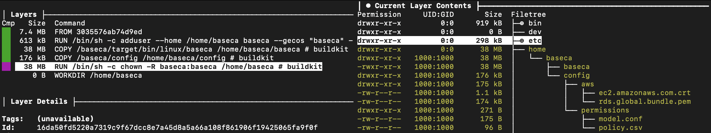

# Production Deployment

`AWS` Dependencies

- [Build Public Key Infrastructure](#public-key-infrastructure)
- [Create baseca Resource Infrastructure](#build-infrastructure)

`baseca` Database Migration

- [Bootstrap RDS Database](#bootstrap-rds-database)

Build and Upload `baseca`:

- [Build and Upload baseca to ECR](#build-and-upload-baseca-to-ecr)

Deploy Compute for `baseca`:

- [Create baseca Compute Infrastructure](#build-compute-infrastructure)

## Public Key Infrastructure

Please read the [`GETTING_STARTED.md`](GETTING_STARTED.md#public-key-infrastructure) documentation and set up a local development environment before proceeding and deploying the production infrastructure.

## Build Infrastructure

### 1. Install Terraform

```sh
brew install tfenv
tfenv install 1.4.2
tfenv use 1.4.2
```

### 2. Configure Resource Module in `baseca/terraform/production`

`baseca` Infrastructure [Documentation](../terraform/README.md#production-deployment-resources)

**NOTE:** Private CA(s) in `acm_pca_arns` must already exist within your infrastructure; refer to the [Public Key Infrastructure](#public-key-infrastructure) section if you need to design and deploy a Public Key Infrastructure.

```sh
# baseca/terraform/production/baseca.tf

module "baseca" {
  source = "./baseca"
  service = "baseca"
  environment = "production"
  region = "us-east-1"
  key_spec = "RSA_4096"
  bucket = "baseca-firehose-example"
  db_ingress = ["10.0.0.0/8"]
  acm_pca_arns = [
    "arn:aws:acm-pca:us-east-1:123456789012:certificate-authority/xxxxxxxx-xxxx-xxxx-xxxx-xxxxxxxxxxxx",
    "arn:aws:acm-pca:us-east-1:987654321098:certificate-authority/yyyyyyyy-yyyy-yyyy-yyyy-yyyyyyyyyyyy"
  ]
}
```

### 3. Deploy Terraform Resource Module

```sh
cd /path/to/baseca/terraform/production

terraform init
terraform apply
```

### 4. Terraform Outputs

These outputs from Terraform will be utilized within the baseca `config.primary.production.aws.yml` configuration file.

```sh
terraform output

# Example Output

ecr_repository = "012345678901.dkr.ecr.us-east-1.amazonaws.com/baseca"
kinesis_firehose_stream = "baseca-production"
kms_key_id = "xxxxxxxxxxxx-xxxx-xxxx-xxxx-xxxxxxxxxxxx"
rds_reader_endpoint = "baseca-production-cluster.cluster-ro-xxxxxxxxxxxx.us-east-1.rds.amazonaws.com"
rds_writer_endpoint = "baseca-production-cluster.cluster-xxxxxxxxxxxx.us-east-1.rds.amazonaws.com"
redis_endpoint = "baseca-production.xxxxxx.0001.use1.cache.amazonaws.com"
```

## Configuration

Update the [`config/config.primary.production.aws.yml`](../examples/config/config.primary.production.aws.yml) configuration file using the outputs from Terraform; an example configuration can be seen within [CONFIGURATION.md](CONFIGURATION.md).

```yml
# Update config.primary.production.aws.yml
database:
  database_endpoint: baseca-production-cluster.cluster-xxxxxxxxxxxx.us-east-1.rds.amazonaws.com # rds_writer_endpoint
  database_reader_endpoint: baseca-production-cluster.cluster-ro-xxxxxxxxxxxx.us-east-1.rds.amazonaws.com # rds_reader_endpoint

redis:
  cluster_endpoint: baseca-production.xxxxxx.0001.use1.cache.amazonaws.com # redis_endpoint

firehose:
  stream: baseca-production

kms:
  key_id: xxxxxxxxxxxx-xxxx-xxxx-xxxx-xxxxxxxxxxxx # kms_key_id
```

| Variable                  | Description                                           | Update   |
| ------------------------- | ----------------------------------------------------- | -------- |
| `grpc_server_address`     | gRPC Server Address and Port                          | No       |
| `ocsp_server`             | Custom OCSP Server URL                                | Optional |
| `database`                | baseca RDS Database                                   | Yes      |
| `redis`                   | baseca Elasticache Redis Cluster                      | Yes      |
| `domains`                 | List of Valid Domains for `baseca` x.509 Certificates | Yes      |
| `firehose`                | baseca Kinesis Data Firehose                          | Yes      |
| `kms`                     | baseca Customer Managed KMS Key                       | Yes      |
| `acm_pca`                 | AWS Private Certificate Authorities                   | Yes      |
| `secrets_manager`         | AWS Secrets Manager                                   | Yes      |
| `subordinate_ca_metadata` | baseca Subordinate CA Attributes                      | Optional |
| `certificate_authority`   | Environment(s) for `acm_pca` Private CA(s)            | Yes      |

## Bootstrap RDS Database

### 1. Search RDS Credentials from Secrets Manager


```yml
# Update config.primary.production.aws.yml
secrets_manager:
  secret_id: rds!cluster-bcc40600-5fa7-4877-aa35-529cae165937
```

### 2. Launch Temporary EC2 Instance

A temporary `Ubuntu` EC2 instance with the requirements below will need to be deployed to perform the database migration.

- Egress Port 80 to 0.0.0.0/0
- Egress Port 5432 to 0.0.0.0/0
- Ingress Port 22 from Local IP
- Deploy in Subnet Routable to RDS Cluster
- Private IP within `db_ingress_cidr` CIDR Block

### 3. Perform Database Migration

[`golang-migrate Download Instructions`](https://github.com/golang-migrate/migrate/blob/master/cmd/migrate/README.md)

```sh
cd /path/to/baseca

# Copy Database Migration Files and RDS Certificate to EC2
scp -i /path/to/your/key.pem -r db/migration ubuntu@[IP_ADDRESS]:/home/ubuntu
scp -i /path/to/your/key.pem internal/attestor/aws_iid/certificate/rds.global.bundle.pem ubuntu@[IP_ADDRESS]:/home/ubuntu

# SSH to EC2
ssh -i /path/to/your/key.pem ubuntu@[IP_ADDRESS]

# Download golang-migrate
curl -L https://github.com/golang-migrate/migrate/releases/download/v4.16.1/migrate.linux-amd64.tar.gz | tar xvz # AMD64 Example

# Execute Database Migration
./migrate -path migration -database "postgresql://[username]:[password]@[rds_writer_endpoint]:5432/baseca?sslmode=verify-full&sslrootcert=/home/ubuntu/rds.global.bundle.pem" -verbose up
```

**Note:** If you see the error below you will need to encode the credentials; please do this `locally` and not through an online encoder.

```
error: parse "postgresql://baseca:[PASSWORD]@[RDS_WRITER_ENDPOINT]:5432/baseca?sslmode=disable": net/url: invalid userinfo
```

### 4. Create Initial Admin User

```sh
# Update db/init/init.sql for Admin User
VALUES (uuid_generate_v4(), 'example@example.com', crypt('ADMIN_CREDENTIALS', gen_salt('bf')), 'Example User', 'example@example.com', 'ADMIN', now());

# Copy db.init/init.sql to EC2
scp -i /path/to/your/key.pem db/init/init.sql ubuntu@[IP_ADDRESS]:/home/ubuntu

# SSH to EC2
ssh -i /path/to/your/key.pem ubuntu@[IP_ADDRESS]

# Download Postgres Client
sudo apt-get update
sudo apt-get install -y postgresql-client

# Run Database Init to Create Admin User
psql -h [rds_writer_endpoint] -U [username] -d baseca -f /path/to/init.sql
```

**Note:** [`Terminate`](https://docs.aws.amazon.com/AWSEC2/latest/UserGuide/terminating-instances.html) the Migration EC2 Instance After Migration Completed

## Build and Upload `baseca` to ECR

### Option A: Build from Published `baseca` Image

_Use this option by using the published image from `baseca` without any code changes or updates to your Dockerfile._

Create `Dockerfile` and Copy [`Configurations`](../config) to `/home/baseca/config` within the Docker Container.

```Dockerfile
FROM ghcr.io/coinbase/baseca:v0.0.1-beta

COPY ./config /home/baseca/config
CMD ["/home/baseca/baseca"]
```

```sh
cd /path/to/Dockerfile
docker build -t baseca .
```

Push Image to ECR Registry

```sh
docker tag baseca <aws-account-id>.dkr.ecr.<region>.amazonaws.com/baseca:latest
aws ecr get-login-password --region <region> | docker login --username AWS --password-stdin <aws-account-id>.dkr.ecr.<region>.amazonaws.com
docker push <aws-account-id>.dkr.ecr.<region>.amazonaws.com/baseca:latest
```

**NOTE:** This is an image built from [`examples/Dockerfile`](../examples/Dockerfile); there are alternative methods to get the config files onto the image, but you must copy your configurations within the `/home/baseca/config` path.



### Option B: Local Build

_Use this option if you have requirements to change the `baseca` image through either custom code changes or updates to the Dockerfile._

```sh
cd /path/to/baseca
docker build -t baseca .

docker tag baseca <aws-account-id>.dkr.ecr.<region>.amazonaws.com/baseca:latest
aws ecr get-login-password --region <region> | docker login --username AWS --password-stdin <aws-account-id>.dkr.ecr.<region>.amazonaws.com
docker push <aws-account-id>.dkr.ecr.<region>.amazonaws.com/baseca:latest
```

## Build Compute Infrastructure

**DISCLAIMER:** The compute deployment is a sample of how `baseca` can run within an environment; if you decide to run this ECS Service as is, be cautious as it has not been fully tested. `baseca` is not intended to run on ephemeral instances; if a design decision is made to run on ephemeral nodes you will need to have a shared volume such as EFS. The `recommended` method is to deploy the service directly on an EC2 instance that supports [`Nitro Enclaves`](https://docs.aws.amazon.com/enclaves/latest/user/using.html); this ensures that key material never leaves the host it was generated on and is never accessible by anything outside of the `baseca` process.

`baseca` Infrastructure [Documentation](../terraform/README.md#production-compute-deployment)

### 1. Configure Compute Module in `baseca/terraform/production`

```sh
# baseca/terraform/production/baseca.tf

module "compute" {
  source = "./compute"
  service = "baseca"
  region = "us-east-1"
  environment = "production"
  configuration = "production"

  vpc_id = "vpc-xxxxxxxx"
  subnet_ids = ["subnet-0123456789abcdef", "subnet-9876543210fedcba"]

  host_port = 9090
  network_ingress = ["10.0.0.0/8"]
  public_ip = false

  baseca_iam_role = module.baseca.baseca_iam_role
  ecr_repository = module.baseca.ecr_repository
  depends_on = [
    module.baseca
  ]
}
```

**NOTE:** `environment` and `configuration` are values used to concatenate and build the configuration file for `baseca`. Within Terraform we auto export these as environment variables within the ECS Task Definition, but if you are using your own deployment you will need to have these environment variables accessible by `baseca`. If the values below were exported then `baseca` would read the `config/config.primary.production.aws.yml` file. Changing `configuration` to `development` would read the `config/config.primary.development.aws.yml` file.

```sh
export ENVIRONMENT=production
export CONFIGURATION=production
```

### 2. Deploy Terraform Compute Module

```sh
cd /path/to/baseca/terraform/production

terraform init
terraform apply
```
